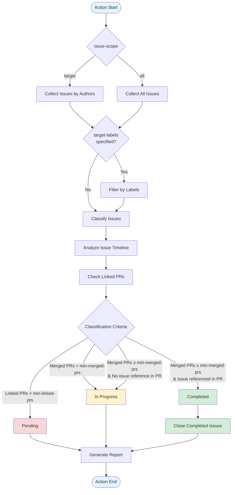

# Issue Cleanup

A GitHub Action to efficiently manage issues generated from AI-based issue creation, PRD document generation, and more. It automatically closes issues when their linked Pull Requests are merged, reducing issue management overhead.

## Key Features

- **Auto-close Issues**: Automatically closes issues when their linked PRs are merged and properly referenced
- **Issue Classification**: Classifies issues into completed, in progress, and pending based on PR status
- **Flexible Filtering**: Filter by issue authors, labels, or process all issues
- **Customizable Thresholds**: Configure minimum linked/merged PR requirements

## Inputs

| Input                   | Description                                                                                                                            | Required | Default    |
| ----------------------- | -------------------------------------------------------------------------------------------------------------------------------------- | -------- | ---------- |
| `github-token`          | GitHub token for API access                                                                                                            | Yes      | -          |
| `issue-scope`           | Issue scope to process: `"target"` (specific authors) or `"all"` (all issues)                                                          | No       | `"target"` |
| `target-issue-creators` | Issue author(s) to filter (comma-separated, e.g., `"github-actions[bot]"`, `"user1,user2"`). Required when `issue-scope` is `"target"` | No       | `""`       |
| `min-linked-prs`        | Minimum number of linked PRs required                                                                                                  | No       | `"1"`      |
| `min-merged-prs`        | Minimum number of merged PRs required                                                                                                  | No       | `"1"`      |
| `target-labels`         | Issue label(s) to filter (comma-separated, e.g., `"bug"`, `"bug,auto"`)                                                                | No       | `""`       |

## Outputs

| Output              | Description                   |
| ------------------- | ----------------------------- |
| `completed-count`   | Number of completed issues    |
| `in-progress-count` | Number of issues in progress  |
| `pending-count`     | Number of pending issues      |
| `report`            | Generated report summary text |

## Quick Start

### Basic Usage - Target Specific Authors

```yaml
name: Close completed issues created by github-actions[bot]
on:
  schedule:
    - cron: "0 0 * * *" # Daily at midnight
  workflow_dispatch:

jobs:
  cleanup:
    runs-on: ubuntu-latest

    permissions:
      issues: write
      pull-requests: read

    steps:
      - uses: bangdori/issue-cleanup-actions@v1.1.0
        with:
          github-token: ${{ secrets.GITHUB_TOKEN }}
          issue-scope: target
          target-issue-creators: "github-actions[bot]"
          target-labels: "auto"
```

### Process All Issues

```yaml
name: Close completed issues with auto label in repository
on:
  schedule:
    - cron: "0 0 * * *" # Daily at midnight
  workflow_dispatch:

jobs:
  cleanup:
    runs-on: ubuntu-latest

    permissions:
      issues: write
      pull-requests: read

    steps:
      - uses: bangdori/issue-cleanup-actions@v1.1.0
        with:
          github-token: ${{ secrets.GITHUB_TOKEN }}
          issue-scope: all
          target-labels: "auto"
```

### Using Outputs

```yaml
name: Clean up issues by github-actions[bot] and print results
on:
  schedule:
    - cron: "0 0 * * *" # Daily at midnight
  workflow_dispatch:

jobs:
  cleanup:
    runs-on: ubuntu-latest

    permissions:
      issues: write
      pull-requests: read

    steps:
      - uses: bangdori/issue-cleanup-actions@v1.1.0
        id: cleanup
        with:
          github-token: ${{ secrets.GITHUB_TOKEN }}
          issue-scope: target
          target-issue-creators: "github-actions[bot]"
          target-labels: "auto"

      - name: Print summary
        run: |
          echo "Completed: ${{ steps.cleanup.outputs.completed-count }}"
          echo "In Progress: ${{ steps.cleanup.outputs.in-progress-count }}"
          echo "Pending: ${{ steps.cleanup.outputs.pending-count }}"

      - name: Print report
        run: echo "${{ steps.cleanup.outputs.report }}"
```

## How It Works



### Issue Classification Logic

This action classifies issues into three states based on two thresholds (`min-linked-prs`, `min-merged-prs`) and PR body references:

**Threshold Configuration:**

- **`min-linked-prs`**: Minimum number of PRs that reference the issue (includes open, closed, and merged)
- **`min-merged-prs`**: Minimum number of PRs that are actually merged

**Configuration Examples:**

- `min-linked-prs: 1, min-merged-prs: 1` - Close when 1 PR is linked and merged (default, suitable for typical issues)
- `min-linked-prs: 2, min-merged-prs: 2` - Require 2+ PRs (useful when AI tools like [claude-code-action](https://github.com/anthropics/claude-code-action) auto-create 1 reference PR during issue creation)

**Classification Criteria:**

#### 1. **Pending**

- Linked PRs < `min-linked-prs`
- Not enough PRs reference the issue

#### 2. **In Progress**

- Linked PRs ≥ `min-linked-prs` AND Merged PRs < `min-merged-prs`
- OR: Merged PRs ≥ `min-merged-prs` BUT no PR body explicitly references the issue

#### 3. **Completed** (Auto-closed)

- Linked PRs ≥ `min-linked-prs`
- AND Merged PRs ≥ `min-merged-prs`
- AND at least one merged PR body contains an explicit issue reference (e.g., `fixes #5`, `closes #10`)

**Why Check PR Body References?**

Even if PRs are merged, they might not actually fix the issue. For example, if an issue is only mentioned in PR comments, it appears in the timeline but may not indicate an intentional fix. This ensures:

- PRs intentionally resolved the issue (not just incidentally linked)
- Prevents auto-closing issues that still need work

**Example:**

```
Issue #5: "Fix login bug"

Scenario A - Will NOT close:
✗ PR #10: "Refactor auth module" (merged, no #5 in body)
✗ PR #11: "Update tests" (merged, no #5 in body)
→ Status: In Progress (merged but not fixing this specific issue)

Scenario B - Will close:
✓ PR #10: "Fix login bug, closes #5" (merged, references #5)
→ Status: Completed (explicitly fixes the issue)
```

## License

MIT
